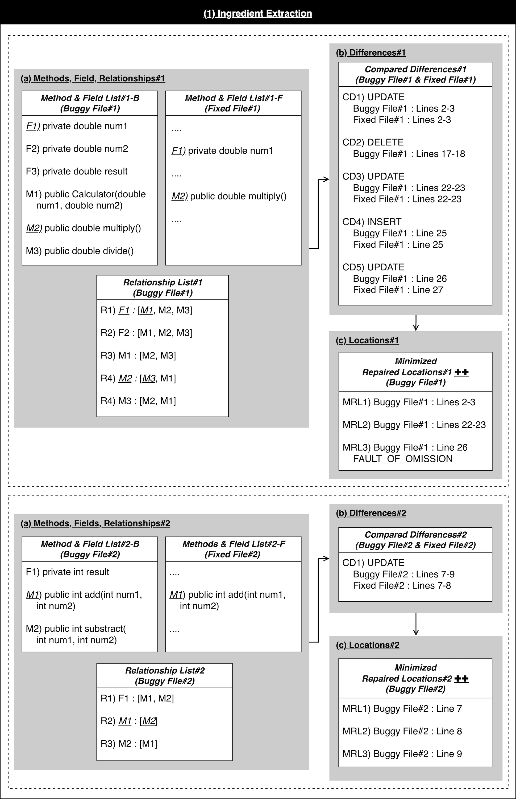

# MCRepair++
* An automated program repair (APR) technique that applied minimized repaired locations, revised patch filtering and ranking, and proportional patch combination to its previous work ["MCRepair"](https://dl.acm.org/doi/10.1145/3555776.3577762) for complex multi-chunk bugs.
  * MCRepair
    * An APR technique that utilized a buggy block, patch optimization, and CodeBERT to target complex multi-chunk bugs.
      * "Buggy block" is a method that binds buggy chunks into a multi-buggy chunk using method and field dependencies to address large patch space and dependency problems between buggy chunks.
      * "Patch optimization" is a strategy that combines candidate patches after filtering and ranking to address a patch combination problem.
      * "CodeBERT" is a specific BERT deep learning model designed for source code datasets to address a few datasets and out-of-vocabulary problems.
  * Improvements
    * "Minimized repaired locations" are repaired locations that merge the divided cases and exclude overlapped cases to improve the buggy block and CodeBERT.
    * "Revised patch filtering and ranking" are patch filtering and ranking that add a new rule for unrelated patches and decreases calculate a high score with fewer expected actions and union denominator to improve the patch optimization.
    * "Proportional patch combination" is a patch combination that yields higher top k values to improve the patch optimization.
* Figures
  * [Figure 1:](./figures/Figure1.png) Comparison of Buggy Locations between MCRepair and MCRepair++. (RL: Repaired location, MRL: Minimized repaired location, "✚✚": Plus-Plus related to our improvements, FAULT_OF_OMISSION: A location related to one or more INSERT actions)
  * [Figure 2:](./figures/Figure2.png) Comparison of Patch Filtering and Ranking between MCRepair and MCRepair++. (SW: Stop-words)
  * [Figure 3:](./figures/Figure3.png) Comparison of Patch Combination between MCRepair and MCRepair++. (bLocs: The number of buggy locations for each chunk)
  * [Figure 4:](./figures/Figure4.png) An overview of MCRepair++. (▲: Only use for training or validation, ◆: Only use for generation)
    
  * [Figure 5:](./figures/Figure5.png) An example of the source code datasets. (–: Buggy location, +: Fixed location)
  * [Figure 6:](./figures/Figure6.png) Detailed depiction of Ingredient Extraction. (M: Method, F: Field, R: Relationship, CD: Compared Difference, MRL: Minimized Repaired Location)
  * [Figure 7:](./figures/Figure7.png) Detailed depiction of Buggy Block Preprocessing. (ST: Special Tokens, TR: Truncation)
  * [Figure 8:](./figures/Figure8.png) Detailed depiction of Fine-tuning and Patch Generation. 
  * [Figure 9:](./figures/Figure9.png) An example of the candidate patches generated by the fine-tuned CodeBERT.
  * [Figure 10:](./figures/Figure10.png) Detailed depiction of Patch Optimization. (DP: Duplicated, SE: Syntax Errors, TM: Terminated, SW: Stop-words)
  * [Figure 11:](./figures/Figure11.png) An example of the calculations in Proportional Patch Combination.
  * [Figure 12:](./figures/Figure12.png) Detailed depiction of Patch Evaluation. (FA: Failed, CO: Compilable, PL: Plausible, CR: Correct)
  * Figure 13: RQ1. Statistics of evaluated results on Defects4J.
    * [Figure 13: (a) Repaired patches](./figures/Figure13a.png)
    * [Figure 13: (b) Repaired bugs](./figures/Figure13b.png)
  * [Figure 14:](./figures/Figure14.png) RQ2. Venn Diagram for Table 4. (Underlined: Unique <u>Type 3</u> bugs)
    * [Figure 14: (a) Between MCRepair++ and MCRepair](./figures/Figure14a.png)
    * [Figure 14: (b) Between MCRepair++ and Others](./figures/Figure14b.png)
  * Figure 15: RQ3. Statistics per range on Defects4J <u>with</u> Perfect Fault Localization.
    * [Figure 15: (a) Chunk range](./figures/Figure15a.png)
    * [Figure 15: (b) Location range](./figures/Figure15b.png)
<br><br>

## 1. Location-level criterion
We strengthened the location-level criterion to prevent an infinite number of locations as follows:
* We excluded blank, comment, and null locations that were not related to “FAULT_OF_OMISSION.”
    - “FAULT_OF_OMISSION” indicates a buggy location related to one or more insertions.
    - A null location indicates a location that does nothing (e.g., “;” and “for (int j = 0; j < 5; j++);”).
    - A block end is not a null location because it designates a flow range.
* We checked whether each location was correct or not.
* We identified divided and overlapped locations.
<br><br>

## 2. Bug types
We classified the performances of our approach and baselines per bug type using the location-level criterion as follows: 
* "Type 1" indicates a single-chunk bug that uses or fixes a location.
    - "T1B" denotes a "Type 1" that uses a location for fixing.
    - "T1F" denotes a "Type 1" that fixes a location.
* "Type 2" indicates a single-chunk bug that uses or fixes locations.
    - "T2B" denotes a "Type 2" that uses locations for fixing.
    - "T2F" denotes a "Type 2" that fixes locations.
* "Type 3" indicates a multi-chunk bug that uses or fixes chunks.
    - "T3B" denotes a "Type 3" that uses chunks for fixing.
    - "T3F" denotes a "Type 3" that fixes chunks.

The difficulties were in the order of "Type 3," "Type 2," and "Type 1". When a module had all the types, we resulted in "Type 3" based on the difficulties.
<br><br>

## 3. Statstics of combined patches per evaluated result (331/2.25 K/82.75 K)
```powershell
  |--- Total (331/2.25 K/82.75 K)
  |------ Compilable: 82,750
  |------ Plausible: 2,252
  |------ Correct: 331
```
<br><br>

## 4. Statstics of repaired bugs per evaluated result (79/89)
```powershell
  |--- Total (79/89)
  |------ Chart (6/8)
  |--------- Plausible (2) : [C_25, 26]
  |--------- Correct (6)   : [C_1, 8, 9, 11, 20, 24]
  |------ Closure (21/22)
  |--------- Plausible (1) : [CL_124]
  |--------- Correct(21)   : [CL_2, 6, 7, 10, 11, 13, 19, 38, 40, 46, 57, 62, 86, 92, 101, 102, 107, 109, 115, 122, 125]
  |------ Lang (12/13)
  |--------- Plausible (1) : [L_17]
  |--------- Correct (12)  : [L_6, 10, 20, 29, 34, 43, 51, 55, 57, 59, 61, 64]
  |------ Math (30/35)
  |--------- Plausible (5) : [M_28, 33, 73, 84, 95]
  |--------- Correct (30)  : [M_2, 5, 8, 22, 27, 30, 32, 34, 41, 43, 46, 56, 57, 58, 62, 63, 65, 70, 72, 75, 77, 79, 80, 82, 85, 86, 96, 98, 101, 104]
  |------ Mockito (6/6) 
  |--------- Correct (6)   : [MC_1, 5, 8, 22, 29, 38]
  |------ Time (4/5)
  |--------- Plausible (1) : [T_18]
  |--------- Correct (4)   : [T_4, 7, 17, 19]
```
<br><br>

## 5. Details of correctly repaired bugs (79)
* Chart (6)
  * [C_1](./results/markdowns/Chart_1.md), [C_8](./results/markdowns/Chart_8.md), [C_9](./results/markdowns/Chart_9.md)
  * [C_11](./results/markdowns/Chart_11.md)
  * [C_20](./results/markdowns/Chart_20.md), [C_24](./results/markdowns/Chart_24.md)
* Closure (21)
  * [CL_2](./results/markdowns/Closure_2.md), [CL_6](./results/markdowns/Closure_6.md), [CL_7](./results/markdowns/Closure_7.md)
  * [CL_10](./results/markdowns/Closure_10.md), [CL_11](./results/markdowns/Closure_11.md), [CL_13](./results/markdowns/Closure_13.md), [CL_19](./results/markdowns/Closure_19.md)
  * [CL_38](./results/markdowns/Closure_38.md)
  * [CL_40](./results/markdowns/Closure_40.md), [CL_46](./results/markdowns/Closure_46.md)
  * [CL_57](./results/markdowns/Closure_57.md)
  * [CL_62](./results/markdowns/Closure_62.md)
  * [CL_86](./results/markdowns/Closure_86.md)
  * [CL_92](./results/markdowns/Closure_92.md)
  * [CL_101](./results/markdowns/Closure_101.md), [CL_102](./results/markdowns/Closure_102.md), [CL_107](./results/markdowns/Closure_107.md), [CL_109](./results/markdowns/Closure_109.md)
  * [CL_115](./results/markdowns/Closure_115.md)
  * [CL_122](./results/markdowns/Closure_122.md), [CL_125](./results/markdowns/Closure_125.md)
* Lang (12)
  * [L_6](./results/markdowns/Lang_6.md)
  * [L_10](./results/markdowns/Lang_10.md)
  * [L_20](./results/markdowns/Lang_20.md), [L_29](./results/markdowns/Lang_29.md)
  * [L_34](./results/markdowns/Lang_34.md)
  * [L_43](./results/markdowns/Lang_43.md)
  * [L_51](./results/markdowns/Lang_51.md), [L_55](./results/markdowns/Lang_55.md), [L_57](./results/markdowns/Lang_57.md), [L_59](./results/markdowns/Lang_59.md)
  * [L_61](./results/markdowns/Lang_61.md), [L_64](./results/markdowns/Lang_64.md)
* Math (30)
  * [M_2](./results/markdowns/Math_2.md), [M_5](./results/markdowns/Math_5.md), [M_8](./results/markdowns/Math_8.md)
  * [M_22](./results/markdowns/Math_22.md), [M_27](./results/markdowns/Math_27.md)
  * [M_30](./results/markdowns/Math_30.md), [M_32](./results/markdowns/Math_32.md), [M_34](./results/markdowns/Math_34.md)
  * [M_41](./results/markdowns/Math_41.md), [M_43](./results/markdowns/Math_43.md), [M_46](./results/markdowns/Math_46.md)
  * [M_56](./results/markdowns/Math_56.md), [M_57](./results/markdowns/Math_57.md), [M_58](./results/markdowns/Math_58.md)
  * [M_62](./results/markdowns/Math_62.md), [M_63](./results/markdowns/Math_63.md), [M_65](./results/markdowns/Math_65.md)
  * [M_70](./results/markdowns/Math_70.md), [M_72](./results/markdowns/Math_72.md), [M_75](./results/markdowns/Math_75.md), [M_77](./results/markdowns/Math_77.md), [M_79](./results/markdowns/Math_79.md)
  * [M_80](./results/markdowns/Math_80.md), [M_82](./results/markdowns/Math_82.md), [M_85](./results/markdowns/Math_85.md), [M_86](./results/markdowns/Math_86.md)
  * [M_96](./results/markdowns/Math_96.md), [M_98](./results/markdowns/Math_98.md)
  * [M_101](./results/markdowns/Math_101.md), [M_104](./results/markdowns/Math_104.md)
* Mockito (6)
  * [MC_1](./results/markdowns/Mockito_1.md), [MC_5](./results/markdowns/Mockito_5.md), [MC_8](./results/markdowns/Mockito_8.md)
  * [MC_22](./results/markdowns/Mockito_22.md), [MC_29](./results/markdowns/Mockito_29.md)
  * [MC_38](./results/markdowns/Mockito_38.md)
* Time (4)
  * [T_4](./results/markdowns/Time_4.md), [T_7](./results/markdowns/Time_7.md)
  * [T_17](./results/markdowns/Time_17.md), [T_19](./results/markdowns/Time_19.md)
<br><br>

## 6. Statstics of correctly repaired bugs (79)
### 6.1. Statstics of correctly repaired bugs (79)
```powershell
  |--- Total (79)
  |------ Chart (6)    : [C_1, 8, 9, 11, 20, 24]
  |------ Closure (21) : [CL_2, 6, 7, 10, 11, 13, 19, 38, 40, 46, 57, 62, 86, 92, 101, 102, 107, 109, 115, 122, 125]
  |------ Lang (12)    : [L_6, 10, 20, 29, 34, 43, 51, 55, 57, 59, 61, 64]
  |------ Math (30)    : [M_2, 5, 8, 22, 27, 30, 32, 34, 41, 43, 46, 56, 57, 58, 62, 63, 65, 70, 72, 75, 77, 79, 80, 82, 85, 86, 96, 98, 101, 104]
  |------ Mockito (6)  : [MC_1, 5, 8, 22, 29, 38]
  |------ Time (4)     : [T_4, 7, 17, 19]
```
<br>

### 6.2. Statstics of correctly repaired bugs per bug type (79)
```powershell
  |--- Total (79)
  |------ Chart (6)
  |--------- Type 1 (5)    : [C_8, 9, 11, 20, 24]
  |--------- Type 3 (1)    : [C_1]
  |------ Closure (21)
  |--------- Type 1 (8)    : [CL_10, 38, 57, 62, 92, 109, 122, 125]
  |--------- Type 2 (3)    : [CL_19, 101, 107]
  |--------- Type 3 (10)   : [CL_2, 6, 7, 11, 13, 40, 46, 86, 102, 115]
  |------ Lang (12)
  |--------- Type 1 (6)    : [L_6, 29, 43, 57, 59, 61]
  |--------- Type 2 (1)    : [L_51]
  |--------- Type 3 (5)    : [L_10, 20, 34, 55, 64]
  |------ Math (30)
  |--------- Type 1 (16)   : [M_2, 5, 27, 30, 32, 34, 41, 57, 58, 65, 70, 80, 85, 96, 101, 104]
  |--------- Type 2 (2)    : [M_56, 63]
  |--------- Type 3 (12)   : [M_8, 22, 43, 46, 62, 72, 75, 77, 79, 82, 86, 98]
  |------ Mockito (6)
  |--------- Type 1 (4)    : [MC_5, 8, 29, 38]
  |--------- Type 2 (1)    : [MC_1]
  |--------- Type 3 (1)    : [MC_22]
  |------ Time (4)
  |--------- Type 1 (2)    : [T_4, 19]
  |--------- Type 3 (2)    : [T_7, 17]
```
<br>

### 6.3. Statstics of correctly repaired bugs per chunk (79)
```powershell
  |--- Total (79)
  |------ 1 chunk (48)
  |--------- Chart (5)     : [C_8, 9, 11, 20, 24]
  |--------- Closure (11)  : [CL_10, 19, 38, 57, 62, 92, 101, 107, 109, 122, 125]
  |--------- Lang (7)      : [L_6, 29, 43, 51, 57, 59, 61]
  |--------- Math (18)     : [M_2, 5, 27, 30, 32, 34, 41, 56, 57, 58, 63, 65, 70, 80, 85, 96, 101, 104]
  |--------- Mockito (5)   : [MC_1, 5, 8, 29, 38]
  |--------- Time (2)      : [T_4, 19]
  |------ 2 chunks (23)
  |--------- Chart (1)     : [C_1]
  |--------- Closure (4)   : [CL_2, 7, 11, 86]
  |--------- Lang (4)      : [L_20, 34, 55, 64]
  |--------- Math (11)     : [M_8, 22, 46, 62, 72, 75, 77, 79, 82, 86, 98]
  |--------- Mockito (1)   : [MC_22]
  |--------- Time (2)      : [T_7, 17]
  |------ 3 chunks (7)
  |--------- Closure (5)   : [CL_13, 40, 46, 102, 115]
  |--------- Lang (1)      : [L_10]
  |--------- Math (1)      : [M_43]
  |------ 4 chunks (1)
  |--------- Closure (1)   : [CL_6]
```
<br>

### 6.4. Statstics of correctly repaired bugs per location (79)
```powershell
  |--- Total (79)
  |------ 1 location (41)
  |--------- Chart (5)     : [C_8, 9, 11, 20, 24]
  |--------- Closure (8)   : [CL_10, 38, 57, 62, 92, 109, 122, 125]
  |--------- Lang (6)      : [L_6, 29, 43, 57, 59, 61]
  |--------- Math (16)     : [M_2, 5, 27, 30, 32, 34, 41, 57, 58, 65, 70, 80, 85, 96, 101, 104]
  |--------- Mockito (4)   : [MC_5, 8, 29, 38]
  |--------- Time (2)      : [T_4, 19]
  |------ 2 locations (14)
  |--------- Chart (1)     : [C_1]
  |--------- Closure (1)   : [CL_19]
  |--------- Lang (4)      : [L_20, 34, 55, 64]
  |--------- Math (7)      : [M_22, 46, 72, 75, 79, 82, 98]
  |--------- Time (1)      : [T_7]
  |------ 3 locations (8)
  |--------- Closure (5)   : [CL_7, 11, 86, 102, 107]
  |--------- Lang (1)      : [L_51]
  |--------- Math (1)      : [M_43]
  |--------- Mockito (1)   : [MC_1]
  |------ 4 locations (5)
  |--------- Closure (4)   : [CL_2, 13, 40, 101]
  |--------- Math (1)      : [M_62]
  |------ 5 locations (4)
  |--------- Math (2)      : [M_8, 63]
  |--------- Mockito (1)   : [MC_22]
  |--------- Time (1)      : [T_17]
  |------ 6 locations (1)
  |--------- Math (1)      : [M_86]
  |------ 7 locations (1)
  |--------- Math (1)      : [M_56]
  |------ 8 locations (1)
  |--------- Closure (1)   : [CL_6]
  |------ 10 locations (2)
  |--------- Lang (1)      : [L_10]
  |--------- Math (1)      : [M_77]
  |------ 12 locations
  |--------- Closure (1)   : [CL_115]
  |------ 13 locations
  |--------- Closure (1)   : [CL_46]
```
<br><br>
